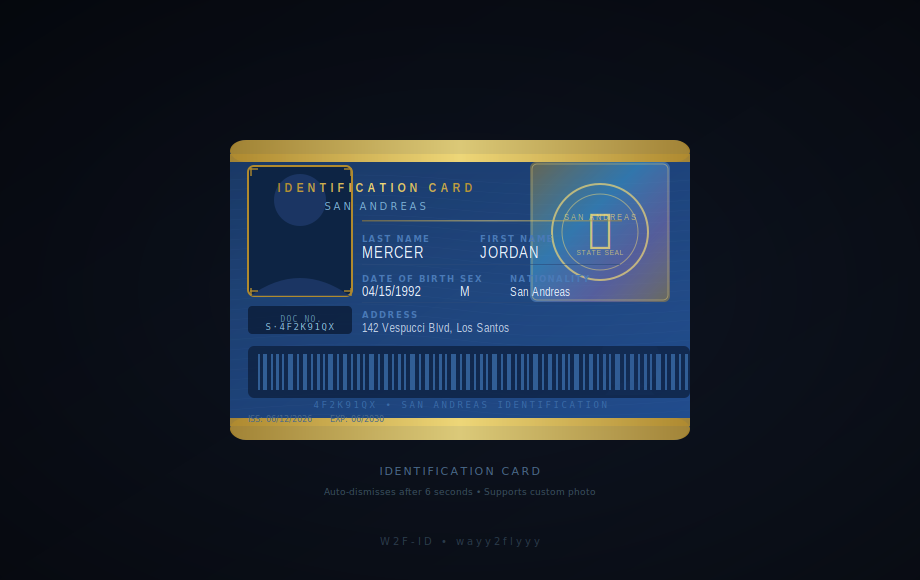
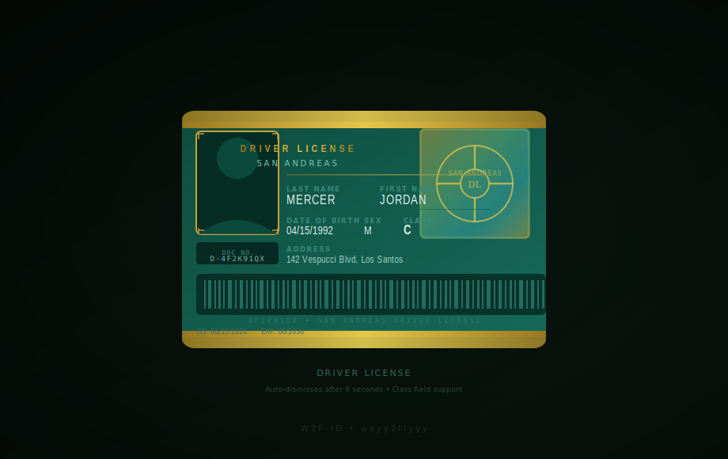
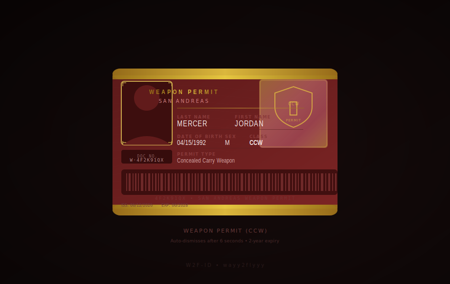
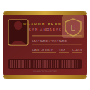

# W2F-ID

> **Visual ID card system for FiveM** — display a beautiful, animated ID card, Driver License, or Weapon Permit as a HUD overlay whenever a player uses the corresponding item.

Supports **QBX · QBCore · ESX** with native **ox_inventory** items out of the box.

---

## Previews

| Identification Card | Driver License | Weapon Permit |
|:-------------------:|:--------------:|:-------------:|
|  |  |  |

### Card Details

Each card features:
- **Guilloche** fine-line security pattern
- **Iridescent hologram** corner panel with emblem
- **Barcode** generated deterministically from the citizen ID
- **Ghost watermark** photo in the lower-right corner
- Smooth **entry / exit animations** with elastic easing and glare sweep
- **Auto-dismiss** after a configurable timeout (default 6 s)
- Up to **3 stacked cards** on screen simultaneously
- Optional **custom player photo** via URL

---

## Item Images

| Item | Preview |
|------|---------|
| `id_card` |  |
| `driver_license` |  |
| `weapon_permit` |  |

---

## Installation

### 1 · Download

Clone the repository or download the latest release and drop the `w2f-id` folder into your server's `resources` directory.

```
[resources]
└── w2f-id/
    ├── fxmanifest.lua
    ├── config.lua
    ├── client/
    ├── server/
    ├── html/
    └── items/
```

### 2 · Add to server.cfg

```cfg
ensure w2f-id
```

### 3 · Register items

Choose the section that matches your framework.

---

#### ox_inventory

Copy the three item definitions from `items/items.lua` into your ox_inventory items file, then copy the item images.

**`[ox_inventory]/data/items.lua`** — add:
```lua
['id_card'] = {
    label       = 'Identification Card',
    weight      = 10,
    stack       = false,
    close       = true,
    description = 'A government-issued identification card.',
},
['driver_license'] = {
    label       = 'Driver License',
    weight      = 10,
    stack       = false,
    close       = true,
    description = 'A valid San Andreas driver license.',
},
['weapon_permit'] = {
    label       = 'Weapon Permit',
    weight      = 10,
    stack       = false,
    close       = true,
    description = 'A concealed carry weapon permit (CCW).',
},
```

**Item images** — copy (or convert) the SVGs to PNG and place them in:
```
[ox_inventory]/web/images/
    id_card.png
    driver_license.png
    weapon_permit.png
```

> The `items/` folder in this resource contains ready-made SVG sources. Convert to 128×128 PNG with any image editor or the free tool [Inkscape](https://inkscape.org/).

---

#### QBCore

Add the entries from `items/items_qbcore.lua` into **`[qb-core]/shared/items.lua`**, then copy item images to **`[qb-inventory]/html/images/`** (or your active inventory's image folder).

---

#### QBX

QBX uses ox_inventory natively — follow the **ox_inventory** section above.

---

#### ESX

Items are registered automatically at runtime via `ESX.RegisterUsableItem`. You still need to add the item definitions to your ESX item table (usually `es_extended/data/items.lua` or your database `items` table), and copy the images to your active inventory's images folder.

---

### 4 · Configure

Edit `config.lua` to match your server:

```lua
-- Framework: 'auto' is recommended
Config.Framework = 'auto'   -- 'auto' | 'qbx' | 'qbcore' | 'esx'

-- Item names (must match what you registered above)
Config.Items = {
    id_card        = 'id_card',
    driver_license = 'driver_license',
    weapon_permit  = 'weapon_permit',
}

-- How long the card stays on screen (milliseconds)
Config.TTL = 6000

-- Maximum simultaneous cards visible
Config.MaxCards = 3

-- Jurisdiction text on each card
Config.State = 'SAN ANDREAS'
```

---

## Framework Support Matrix

| Feature | QBX | QBCore | ESX |
|---------|:---:|:------:|:---:|
| Auto-detect | ✅ | ✅ | ✅ |
| Item use | ✅ | ✅ | ✅ |
| Player name | ✅ | ✅ | ✅ |
| Date of birth | ✅ | ✅ | ✅ |
| Citizen ID | ✅ | ✅ | ✅ (derived) |
| Sex / gender | ✅ | ✅ | ✅ |
| Address | ✅ | ✅ | — |
| Nationality | ✅ | ✅ | ✅ |

---

## Commands

Three debug commands are registered for admins (no ace permission required by default — restrict via `server.cfg` ACE if needed):

| Command | Card shown |
|---------|-----------|
| `/showid` | Identification Card |
| `/showlicense` | Driver License |
| `/showweapon` | Weapon Permit |

Disable any command by setting its value to `false` in `config.lua`:

```lua
Config.Commands = {
    showId      = false,       -- disabled
    showLicense = 'showlicense',
    showWeapon  = 'showweapon',
}
```

---

## NUI API

You can trigger cards directly from any other resource:

```lua
-- Server → Client
TriggerClientEvent('w2f-id:showCard', source, 'id', {
    firstname   = 'Jordan',
    lastname    = 'Mercer',
    dob         = '04/15/1992',
    sex         = 'M',
    nationality = 'San Andreas',
    cid         = '4F2K91QX',
    iss         = '06/12/2026',
    exp         = '06/2030',
    address     = '142 Vespucci Blvd, Los Santos',
    photo       = '',           -- optional: URL to a player photo
})
-- cardType: 'id' | 'driver' | 'weapon'
```

---

## File Structure

```
w2f-id/
├── fxmanifest.lua          Resource manifest
├── config.lua              All configuration
├── client/
│   └── main.lua            Client logic (framework bootstrap, NUI bridge)
├── server/
│   └── main.lua            Server logic (item registration, player data)
├── html/
│   └── index.html          NUI overlay (self-contained, no dependencies)
├── items/
│   ├── id_card.svg         Inventory icon — ID Card
│   ├── driver_license.svg  Inventory icon — Driver License
│   ├── weapon_permit.svg   Inventory icon — Weapon Permit
│   ├── items.lua           ox_inventory item definitions
│   └── items_qbcore.lua    QBCore / QBX item definitions
└── preview/
    ├── id_card_preview.svg
    ├── driver_license_preview.svg
    └── weapon_permit_preview.svg
```

---

## Dependencies

| Dependency | Required | Notes |
|-----------|:--------:|-------|
| One of: `qbx_core`, `qb-core`, `es_extended` | ✅ | At least one framework must be running |
| `ox_inventory` | Optional | Required for ox item use on QBX; works with QB-inventory / qs-inventory on QBCore |

---

## FAQ

**Cards don't appear when I use the item**
- Make sure `ensure w2f-id` comes **after** your framework in `server.cfg`
- Check the server console for `[w2f-id]` log lines — the framework detection result is printed on resource start

**Wrong player data on the card**
- Open `config.lua` and set `Config.Framework` explicitly instead of using `'auto'`
- For ESX, try adjusting `Config.ESX.dobKey` if the date of birth is blank

**Item image not showing in inventory**
- Confirm the PNG is in the correct `images/` folder for your inventory (ox_inventory, qb-inventory, qs-inventory, etc. all differ)
- The filename must match the item name exactly, e.g. `id_card.png`

---

## License

Released under the **MIT License** — free to use, modify, and redistribute with attribution.

---

*Made with ❤️ by [wayy2flyyy](https://github.com/wayy2flyyy)*
